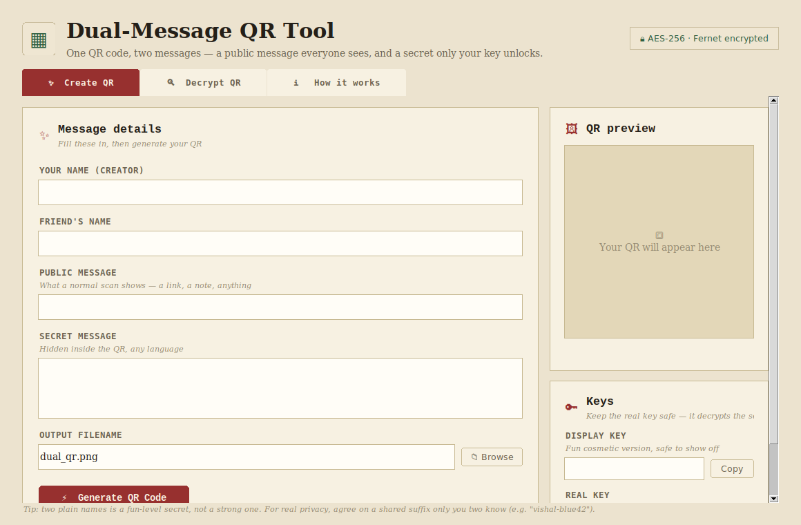
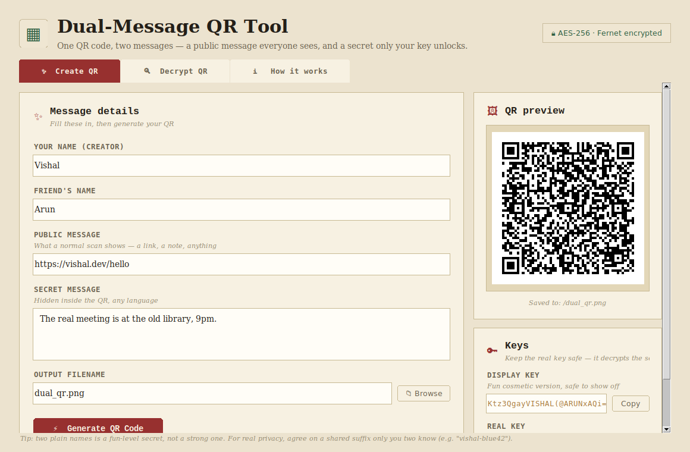
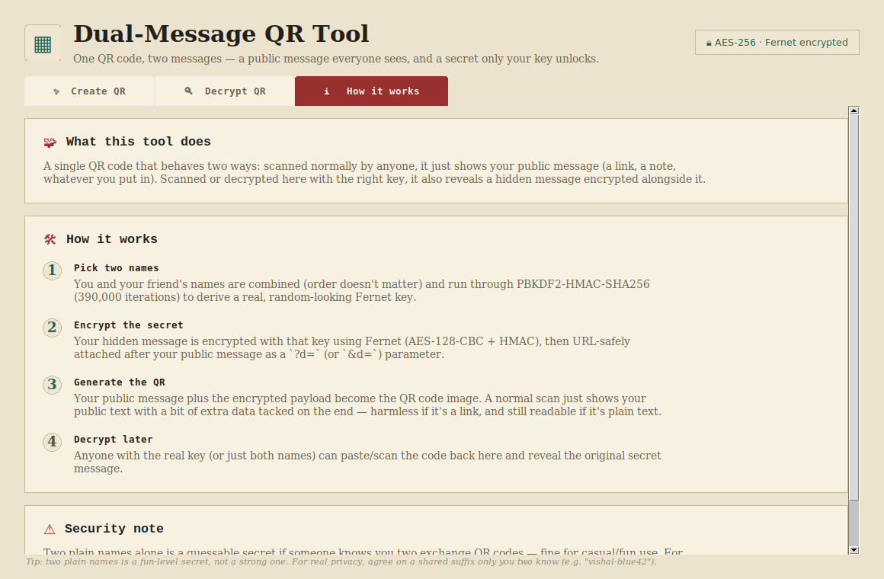

# Dual-Message QR Tool

A desktop app (Tkinter GUI, packaged to a Windows `.exe` via PyInstaller) that
hides a **second, encrypted message** inside an ordinary-looking QR code.

- **Public layer** — a normal URL/text that any phone camera or QR scanner
  reads instantly, same as any QR code.
- **Hidden layer** — a message encrypted and packed into that same QR code,
  only readable by someone with the right key. The key can be a randomly
  generated one, or deterministically derived from two people's names, so
  either person can regenerate it later without saving it anywhere.

Two cipher backends are supported: **Fernet** (AES-128-CBC + HMAC, the
original default) and **AES-256-GCM** (added later as an alternate, stronger
option).

## Screenshots

| Create a QR | Generated QR + keys |
|---|---|
|  |  |

| Decrypt result | How it works |
|---|---|
|  |  |

## How it works

1. **Create tab** — type a public message/URL (what anyone scanning the code
   sees) and a secret message. Either generate a random key or derive one
   from two names. The app encrypts the secret message, packs it as a query
   parameter on the public URL, and renders the whole thing as one QR code.
2. **Decrypt tab** — scan a generated code (from an image file or a live
   webcam feed) and supply the matching key. The app extracts and decrypts
   the hidden payload.
3. Anyone without the key just sees the public URL/text — the encrypted
   payload looks like harmless extra data in the query string.

## Run it

```bash
pip install -r requirements.txt
python app.py
```

- The camera-scan feature needs a real webcam on the machine running the app.

## Build a Windows .exe

PyInstaller builds a binary for the OS it's *run on* — it can't cross-compile
a Windows `.exe` from Linux/macOS, so this step has to happen on Windows:

1. Copy this repo onto a Windows machine.
2. Open a terminal (cmd/PowerShell) in the project folder.
3. Run `build_exe.bat` (double-click it, or run it from the terminal).
4. The executable lands at `dist\DualMessageQR.exe` — copy that single file
   anywhere and double-click to run it. No Python install needed on the
   machine that runs it.

If Windows Defender/SmartScreen flags the `.exe` on first run (normal for
unsigned PyInstaller builds), click "More info" → "Run anyway".

## Project layout

```
app.py             # the whole app: core crypto/QR logic + Tkinter GUI
requirements.txt   # qrcode[pil], opencv-python, cryptography, Pillow, pyinstaller
build_exe.bat       # PyInstaller build script (run on Windows)
assets/             # app icon (window/taskbar icon + in-app header mark)
screenshots/         # README screenshots
LICENSE             # MIT
```

## Security notes

- Deriving a key from two plain names alone is a fairly weak secret — anyone
  who knows the two of you are exchanging codes could guess it. For anything
  beyond casual/fun use, add a shared suffix only you two know (e.g. a random
  word), or just use a fully random generated key and share it out of band.
- AES-256-GCM keys and Fernet keys are different formats and are **not**
  interchangeable — a QR code must be decrypted with the same backend it was
  created with.

## Version history

This repo's commit history tracks the tool's real evolution. `v1.0.0` is the
starting point — pure encryption/QR core logic, no UI (`generate_key`,
`key_from_names`, `create_dual_qr`, `decrypt_qr_data`, built on
`from cryptography.fernet import Fernet`). Everything from `v1.1.0` onward
builds the GUI, packaging, and the AES-256-GCM backend on top of that same
core. Two earlier drafts (`v0.1.0-proto`, `v0.2.0-proto`) are kept for
history but predate the core refactor.

See [CHANGELOG.md](CHANGELOG.md) for the version-by-version summary, or
browse the tags:

```bash
git log --oneline --decorate
git tag
```

## License

MIT — see [LICENSE](LICENSE).
