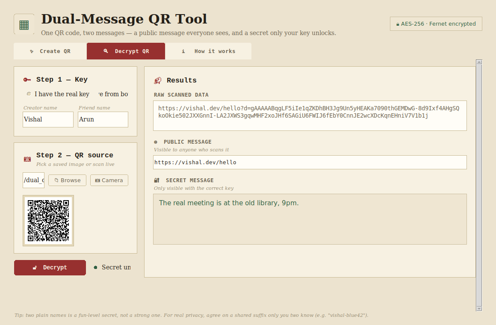

# Dual-Message QR Tool — Desktop (.exe)

This is your original tool with the same logic, just restyled (paper/case-file
look instead of the dark purple-gradient one) so it doesn't look AI-generated.
Nothing about key derivation, encryption, or QR generation/scanning changed.

## Screenshots

| Create a QR | Generated QR + keys |
|---|---|
|  |  |

| Decrypt result | How it works |
|---|---|
|  |  |

## Build the .exe (must be done on Windows)

PyInstaller builds a binary for the OS it's *run on* — it can't cross-compile
a Windows .exe from Linux or Mac. So:

1. Copy this whole folder onto your Windows laptop.
2. Open a terminal (cmd/PowerShell) in this folder.
3. Double-click `build_exe.bat`, or run it from a terminal:

       build_exe.bat

4. Your executable will be at `dist\DualMessageQR.exe` — copy that one file
   anywhere and double-click to run it. No Python install needed on the
   machine you run it on.

## Just want to run it with Python (no .exe)?

       pip install -r requirements.txt
       python app.py

## Notes
- The camera scan feature needs a real webcam on the machine running the app.
- If Windows Defender/SmartScreen flags the .exe on first run (common for
  unsigned PyInstaller builds), click "More info" -> "Run anyway".
